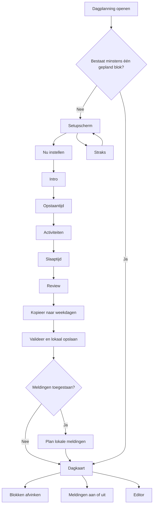

# RecoFree dagstructuur en opbouwwizard

**Doel:** overdraagbaar model voor integratie in een ander mobiel project  
**Bron:** actuele RecoFree-implementatie  
**Scope:** dagstructuur, wizard, lokale opslag, afvinken, meldingen en bewerken  
**Niet opgenomen:** AI, taalarchitectuur en andere RecoFree-wizards

## 1. Functioneel model

RecoFree bouwt de dagstructuur als een **lokale weekplanning met tijdsblokken**. Een gebruiker stelt eerst één voorbeeld­dag samen via een wizard. Die dag kan daarna naar andere weekdagen worden gekopieerd. Na opslag toont de app dagelijks alleen de blokken van vandaag, met afvinkstatus, voortgang, een optionele streak en een meldingenknop.

De functie bestaat uit vier delen:

| Onderdeel | Verantwoordelijkheid |
|---|---|
| Dagplanningtab | Bepaalt of een planning bestaat en toont setup of de planning van vandaag |
| Opbouwwizard | Bouwt één dag op: opstaan, activiteiten, slapen, review en weekkopie |
| Dagkaart | Toont de blokken van vandaag, huidig blok, afvinkstatus, voortgang en meldingen |
| Editor | Laat de volledige week achteraf aanpassen, kopiëren, herschikken en resetten |



## 2. Schermmodel

### 2.1 Dagplanning zonder configuratie

De dagplanningtab start met een rustige, gecentreerde setupkaart. De primaire actie opent de wizard. De secundaire actie **Straks** sluit niets definitief af; ze toont alleen een tijdelijke geruststellende toestand binnen dezelfde schermsessie.

```text
┌────────────────────────────────────┐
│                                    │
│                 📋                 │
│       Dagstructuur instellen       │
│                                    │
│  Plan je dag met vaste blokken.    │
│  Dit helpt structuur en rust te    │
│  vinden.                            │
│                                    │
│        [ Nu instellen ]             │
│             Straks                 │
│                                    │
└────────────────────────────────────┘
```

### 2.2 Wizardstappen

De wizard is een lineaire state machine met zes schermen. Alle stappen behalve de intro tonen onderaan **Opslaan en later verdergaan**. Die actie bewaart een draft met stap, brondag, blokken en timestamp, en sluit de wizard.

| Stap | Inhoud | Primaire actie | Terug |
|---|---|---|---|
| `intro` | Uitleg over vaste dagstructuur | Aan de slag | Niet nodig |
| `wake` | Scrollwiel voor opstaantijd; standaard `07:00` | Volgende | Intro |
| `activities` | Activiteitsnaam, starttijd, eindtijd, lijst en verwijderen | Einde dag | Opstaan |
| `sleep` | Scrollwiel voor slaaptijd; standaard `23:00` | Volgende | Activiteiten |
| `review` | Chronologische daglijst, meldingstype en verwijderen | Ziet er goed uit | Slapen |
| `copy_week` | Brondag plus selectie van andere dagen | Opslaan | Review |

#### Stap 1 — Intro

```text
┌────────────────────────────────────┐
│                 ◷                  │
│         Jouw dagstructuur          │
│                                    │
│  Stel een vaste dag samen met      │
│  opstaan, activiteiten en slapen.  │
│                                    │
│          [ Aan de slag ]           │
└────────────────────────────────────┘
```

#### Stap 2 — Opstaantijd

```text
┌────────────────────────────────────┐
│ ‹                                  │
│ Hoe laat sta je op?                │
│ Kies één vast tijdstip.            │
│                                    │
│              07                    │
│              00                    │
│                                    │
│            [ Volgende ]            │
│   [ Opslaan en later verdergaan ]  │
└────────────────────────────────────┘
```

Het wake-blok is een **tijdstip**, geen interval. Daarom zijn `startTime` en `endTime` gelijk. Het blok krijgt standaard het meldingstype `alarm`.

#### Stap 3 — Activiteiten

```text
┌────────────────────────────────────┐
│ ‹  Vul je dag in                   │
│                                    │
│ [ Naam van activiteit           ]  │
│ [ Start 09:00 ] – [ Einde 10:00 ] │
│ [ + Toevoegen ]                    │
│                                    │
│ Ontbijt                08:00–08:30 │
│ Wandelen               09:00–10:00 │
│ Werk                   10:00–16:00 │
│                                    │
│       [ Einde dag / slaaptijd ]    │
│   [ Opslaan en later verdergaan ]  │
└────────────────────────────────────┘
```

De volgende starttijd wordt automatisch voorgesteld op basis van de eindtijd van de laatste activiteit. Zonder activiteit gebruikt de wizard de opstaantijd; als die ontbreekt, `09:00`. De voorgestelde eindtijd verhoogt het uur met één en begrenst het uur op `23`, terwijl de minuten gelijk blijven. Daardoor kan een starttijd in het laatste uur een gelijke start- en eindtijd opleveren; de finale validatie weigert die nulduur. Een activiteit wordt pas aan de draft toegevoegd wanneer de naam na trimmen niet leeg is.

#### Stap 4 — Slaaptijd

De slaaptijd werkt hetzelfde als de opstaantijd. Het is een tijdstip met gelijke start- en eindtijd. Het standaard meldingstype is `none`.

#### Stap 5 — Review

De review sorteert de blokken voor presentatie chronologisch op `startTime`. Elke rij bevat het bloktype, label, tijd, meldingstype en een verwijderactie met bevestiging. Na bevestiging gaat de wizard naar de weekkopie; er wordt op dit punt nog niets als definitieve planning opgeslagen.

#### Stap 6 — Naar de week kopiëren

De brondag is in de huidige RecoFree-state standaard **maandag**. Alle andere dagen zijn aanvankelijk geselecteerd. De gebruiker kan weekdagen, weekend of losse dagen aan- en uitzetten. Bij opslag wordt een volledig weekschema met zeven dagen gebouwd. Elk gekopieerd blok krijgt een nieuw ID.

```text
┌────────────────────────────────────┐
│ ‹  Kopieer naar andere dagen       │
│                                    │
│ [ Weekdagen ] [ Weekend ]          │
│ ☑ Maandag (bron)                   │
│ ☑ Dinsdag                          │
│ ☑ Woensdag                         │
│ ☑ Donderdag                        │
│ ☑ Vrijdag                          │
│ ☑ Zaterdag                         │
│ ☑ Zondag                           │
│                                    │
│             [ Opslaan ]            │
└────────────────────────────────────┘
```

### 2.3 Dagkaart na configuratie

De dagelijkse kaart leest de huidige lokale weekdag en toont alleen de blokken voor vandaag. Het huidige blok krijgt een subtiele highlight. Een wake- of sleepblok geldt gedurende dertig minuten na zijn tijdstip als actueel; een activiteit geldt tussen start- en eindtijd, inclusief intervallen over middernacht.

```text
┌────────────────────────────────────┐
│ ◫  Dagstructuur              🔔  ✎ │
│                                    │
│ ○ Opstaan                    07:00 │
│ ● Ontbijt              07:30–08:00 │
│ ○ Wandelen             09:00–10:00 │
│ ○ Werk                  10:00–16:00 │
│ ○ Slapen                     23:00 │
│                                    │
│ ███████░░░░░░░░░░░░       1/5     │
│ 🔥 3 dagen               Streak aan│
└────────────────────────────────────┘
```

Een tik op een rij toggelt de completionstatus. De app bewaart completion per lokale kalenderdag en per blok-ID. De voortgang is `completed / total`. De huidige streak telt opeenvolgende dagen waarop minstens één blok werd afgevinkt; de instelling kan worden uitgezet.

### 2.4 Editor na de wizard

De editor is één scherm met zeven weektabs. De huidige lokale weekdag is standaard geselecteerd. Een groene stip markeert dagen die blokken bevatten.

| Bewerking | Gedrag |
|---|---|
| Blok wijzigen | Label, start/einde en meldingstype inline aanpassen |
| Blok verwijderen | Verwijdert en herindexeert de overblijvende blokken |
| Blok verplaatsen | Pijlen omhoog/omlaag; `orderIndex` wordt opnieuw opgebouwd |
| Activiteit toevoegen | Startsuggestie vanaf laatste activiteit of wake-tijd |
| Slaaptijd instellen | Bestaand sleepblok aanpassen of nieuw toevoegen |
| Naar andere dagen kopiëren | Huidige dag volledig of alleen activiteiten naar geselecteerde dagen kopiëren |
| Van andere dag kopiëren | Geconfigureerde brondag naar huidige dag kopiëren |
| Undo | Bewaart vóór kopiëren één in-memory snapshot van het weekschema |
| Wizard herstarten | Verwijdert het dagstructuurdocument na bevestiging en opent de wizard |

Bij **alleen activiteiten kopiëren** blijven bestaande wake- en sleepblokken van de doeldag behouden. De oude activiteiten worden vervangen. Nieuwe kopieën krijgen nieuwe IDs en de volledige lijst wordt opnieuw geïndexeerd.

## 3. Domeinmodel

Onderstaande contracten zijn geschikt als directe basis in een ander TypeScript-project.

```ts
export type Weekday =
  | 'monday' | 'tuesday' | 'wednesday' | 'thursday'
  | 'friday' | 'saturday' | 'sunday';

export type BlockKind = 'wake' | 'activity' | 'sleep';
export type NotificationProfile = 'alarm' | 'push' | 'none';

export interface TimeBlock {
  id: string;
  label: string;
  kind: BlockKind;
  startTime: string;       // HH:mm
  endTime: string;         // HH:mm; mag voor interval over middernacht liggen
  orderIndex: number;      // 0..n-1 binnen de dag
  notificationProfile: NotificationProfile;
}

export interface DaySchema {
  weekday: Weekday;
  blocks: TimeBlock[];
}

export type WeekSchema = Record<Weekday, DaySchema>;

export interface DayStructureDocumentV1 {
  version: 1;
  weekSchema: WeekSchema;
  timezoneAtLastPlanning: string; // IANA timezone
  createdAt: string;              // ISO timestamp
  lastEditedAt: string;           // ISO timestamp
}

export interface DayCompletion {
  localDayKey: string;             // YYYY-MM-DD
  completedBlockIds: string[];
}

export type CompletionStore = Record<string, DayCompletion>;

export type BellState =
  | 'enabled'
  | 'disabled'
  | 'denied'
  | 'not_configured'
  | 'provisional';
```

### 3.1 Wizardstate

```ts
export type WizardStep =
  | 'intro'
  | 'wake'
  | 'activities'
  | 'sleep'
  | 'review'
  | 'copy_week';

export interface DayStructureWizardState {
  currentStep: WizardStep;
  targetDay: Weekday;
  draftBlocks: TimeBlock[];
  copyTargetDays: Weekday[];
}

export interface WizardDraft {
  currentStep: WizardStep;
  targetDay: Weekday;
  draftBlocks: TimeBlock[];
  savedAt: string;
}
```

De state leeft tijdens de wizard in een reducer/context. De ondersteunde acties zijn: stap instellen, brondag instellen, blok toevoegen, verwijderen, wijzigen, volledige draft vervangen, kopiedoelen instellen en resetten.

## 4. Opslagmodel

RecoFree bewaart het weekschema, completion en notificatie-index versleuteld in lokale opslag. Alleen niet-gevoelige voorkeuren zoals de bell state en streaktoggle zijn plain key-valuewaarden.

| Opslagrecord | Inhoud | Advies |
|---|---|---|
| `daystructure_document_v1` | Volledig `DayStructureDocumentV1` | Versleutelen en versiecontroleren |
| `daystructure_completion_v1` | `CompletionStore` per datum | Versleutelen; retentie toepassen |
| `daystructure_notification_index_v1` | IDs van geplande OS-meldingen | Versleutelen of integriteitsbeschermen |
| `daystructure_bell_state` | `BellState` | Plain opslag is voldoende |
| `daystructure_wizard_draft_v1` | Partiële wizarddraft | Versleutelen; verwijderen na definitieve save |
| `daystructure_streaks_enabled` | Boolean voorkeur | Plain opslag is voldoende |

Het opgeslagen document heeft een expliciete `version`. Een onbekende versie mag niet stil als geldig document worden gebruikt. Een lege default wordt pas definitief opgeslagen wanneer de gebruiker de wizard afrondt of een geldige edit uitvoert.

## 5. Validatiecontract

Validatie gebeurt centraal, niet in losse schermen. De service valideert een dag of volledige week vóór persistence.

| Regel | Gedrag |
|---|---|
| Tijdformaat | Alleen `HH:mm`, 24-uursnotatie |
| Activiteitsnaam | Verplicht, na trim minimaal één teken |
| Maximale naam | RecoFreecode gebruikt maximaal 100 tekens |
| Nulduur | Niet toegestaan voor activiteiten; wel voor wake/sleep-tijdstippen |
| Wake | Maximaal één per dag |
| Sleep | Maximaal één per dag |
| Alarm | Alleen geldig voor een wake-blok |
| Overlap | Activiteitsintervallen mogen niet overlappen; middernachtovergang wordt ondersteund |
| Maximum | Maximaal 24 blokken per dag |
| Volgorde | `orderIndex` moet aaneengesloten `0..n-1` zijn |
| Week | Alle zeven dagen moeten aanwezig zijn; een dag mag leeg zijn |

De foutvorm is machineleesbaar:

```ts
export interface ValidationError {
  target: string; // block ID of 'day'
  code:
    | 'INVALID_TIME_FORMAT'
    | 'START_EQUALS_END'
    | 'OVERLAP'
    | 'DUPLICATE_WAKE'
    | 'DUPLICATE_SLEEP'
    | 'ALARM_ON_NON_WAKE'
    | 'MISSING_LABEL'
    | 'INVALID_ORDER_INDEX';
  message: string;
}
```

## 6. Servicecontract

De UI praat niet rechtstreeks met storage. Een feature-service coördineert repository, validatie, helpers en notificaties.

```ts
export interface DayStructureService {
  isConfigured(): Promise<boolean>;
  getDocument(): Promise<DayStructureDocumentV1>;
  saveWeekSchema(schema: WeekSchema): Promise<SaveResult>;
  getDayBlocks(day: Weekday): Promise<TimeBlock[]>;
  getTodayBlocks(): Promise<TimeBlock[]>;
  saveDayBlocks(day: Weekday, blocks: TimeBlock[]): Promise<SaveResult>;
  addBlock(day: Weekday, input: NewBlockInput): Promise<SaveResult>;
  editBlock(day: Weekday, blockId: string, patch: Partial<TimeBlock>): Promise<SaveResult>;
  deleteBlock(day: Weekday, blockId: string): Promise<SaveResult>;
  moveBlock(day: Weekday, from: number, to: number): Promise<SaveResult>;
  copyToSpecificDays(source: Weekday, targets: Weekday[]): Promise<SaveResult>;
  copyActivitiesToSpecificDays(source: Weekday, targets: Weekday[]): Promise<SaveResult>;
  reset(): Promise<void>;
}

interface SaveResult {
  success: boolean;
  errors: string[];
}
```

Iedere schemawijziging schrijft `lastEditedAt` en de actuele timezone opnieuw. Als meldingen aanstaan, worden alle lokale meldingen automatisch opnieuw gepland.

## 7. Meldingen

Meldingen zijn een optionele adapter bovenop hetzelfde weekschema. De planning blijft bruikbaar wanneer toestemming wordt geweigerd.

| Bloktype | Standaardprofiel | Tijdstip |
|---|---|---|
| Wake | `alarm` | Exact op `startTime` |
| Activity | `push` | Tien minuten vóór `startTime` |
| Sleep | `none` | Alleen gepland wanneer profiel later wordt aangezet; tien minuten vooraf |

Na succesvolle wizardopslag vraagt de app OS-toestemming. Bij toestemming zet hij de bell state op `enabled` en plant hij wekelijkse meldingen. Bij schemawijzigingen worden bestaande meldingen geannuleerd en opnieuw opgebouwd. Een rootobserver controleert bij appstart en foreground of de timezone veranderde of het OS alle geplande meldingen verloor.

De bell state moet gebruikersintentie en OS-toestemming onderscheiden. `denied` betekent dat het OS meldingen blokkeert; `disabled` betekent dat de gebruiker ze in de app uitgeschakeld heeft.

## 8. Completion en streaks

Completion is bewust losgekoppeld van het weekschema. Het schema zegt **wat gepland is**; de completionstore zegt **wat op een concrete datum afgevinkt is**.

```ts
async function toggleCompletion(dayKey: string, blockId: string) {
  const current = await completionRepository.get(dayKey);
  const completedBlockIds = current.completedBlockIds.includes(blockId)
    ? current.completedBlockIds.filter(id => id !== blockId)
    : [...current.completedBlockIds, blockId];
  return completionRepository.save({ dayKey, completedBlockIds });
}
```

RecoFree bewaart completion maximaal 90 dagen. De huidige streak telt dagen met **minstens één** afgevinkt blok, niet uitsluitend volledig afgeronde dagen. Voor een andere app moet dit expliciet als productkeuze worden bevestigd.

## 9. Aanbevolen projectstructuur

```text
features/day-structure/
├── model/
│   ├── types.ts
│   ├── constants.ts
│   └── validation.ts
├── domain/
│   ├── helpers.ts
│   ├── day-structure-service.ts
│   ├── completion-service.ts
│   └── time-adapter.ts
├── infrastructure/
│   ├── repository.ts
│   ├── notification-service.ts
│   └── permission-service.ts
├── wizard/
│   ├── wizard-context.tsx
│   ├── intro-step.tsx
│   ├── wake-step.tsx
│   ├── activities-step.tsx
│   ├── sleep-step.tsx
│   ├── review-step.tsx
│   └── copy-week-step.tsx
└── ui/
    ├── day-planning-screen.tsx
    ├── day-structure-card.tsx
    ├── day-structure-editor.tsx
    └── time-picker.tsx
```

De scheiding is belangrijk: schermen sturen intenties naar de service; alleen de service valideert en schrijft; notificaties zijn een adapter; completion is een apart record; tijdslogica loopt via één time port.

## 10. Minimale implementatievolgorde

| Fase | Werk | Acceptatie |
|---|---|---|
| 1 | Types, factories, validatie en time adapter | Geldige/ongeldige dagen zijn deterministisch testbaar |
| 2 | Repository en documentversie | Weekplanning overleeft apprestart en corrupte data crasht niet |
| 3 | Wizardreducer en zes stappen | Eén dag kan zonder persistence worden opgebouwd en gereviewd |
| 4 | Definitieve save en weekkopie | Geselecteerde dagen hebben nieuwe IDs en een valide schema |
| 5 | Dagkaart en completion | Vandaag wordt correct getoond en afvinken blijft per datum bewaard |
| 6 | Editor en undo | CRUD, reorder, twee kopieerrichtingen en één snapshot-undo werken |
| 7 | Meldingen en permissions | Planning blijft werken zonder toestemming; meldingen volgen edits/timezone |
| 8 | Backup/import en migratietests | Document, completion en voorkeuren zijn overdraagbaar en versieveilig |

## 11. Belangrijke huidige RecoFree-keuzes

Deze punten zijn geen vereisten van het domein, maar concrete gedragingen van de huidige implementatie die bij integratie bewust moeten worden overgenomen of verbeterd.

| Huidig gedrag | Betekenis voor integratie |
|---|---|
| Wizard start altijd met `targetDay='monday'` | Maak de brondag expliciet kiesbaar of gebruik de huidige weekdag als dat beter past |
| Alle andere dagen zijn standaard geselecteerd | Eén wizarddoorloop maakt standaard een volledige identieke week |
| Partieel opslaan bewaart alleen de wizarddraft | Het hoofdweekschema blijft ongewijzigd tot de definitieve save |
| Draft wordt na definitieve save niet expliciet verwijderd | Voeg in een nieuwe implementatie `clearDraft()` toe na succesvolle commit |
| Activiteit controleert inline alleen op lege naam | Overlap en overige fouten verschijnen pas bij finale save; beter ook per stap valideren |
| `MIN_BLOCK_DURATION_MINUTES=15` bestaat maar wordt niet afgedwongen | Ofwel werkelijk valideren, of de constante weglaten |
| `NOTIFICATION_LEAD_TIME_MINUTES=0` bestaat, maar de scheduler trekt voor niet-wakeblokken hardcoded tien minuten af | Maak één centrale lead-timebron en test die |
| `isConfigured()` kijkt naar eender welke dag; de dagkaart naar vandaag | Bepaal apart `hasAnySchedule` en `hasScheduleToday` om verwarrende setupstates te vermijden |
| Undo bestaat alleen in React-state | Undo verdwijnt bij navigatie of apprestart; dat is acceptabel voor een korte kopieeractie |
| Streak betekent minstens één blok afgevinkt | Niet verwarren met een volledig afgeronde dag |

## 12. Minimale testmatrix voor het andere project

| Gebied | Verplichte test |
|---|---|
| Factory | Wake=`alarm`, activity=`push`, sleep=`none` |
| Weekmodel | Altijd zeven dagen aanwezig |
| Validatie | Formaat, nulduur, overlap, max één wake/sleep, alarmbeperking, orderindex |
| Middernacht | `22:00–01:00` werkt en overlapt correct |
| Kopiëren | Nieuwe block-IDs; bron blijft intact |
| Activities-only | Wake/sleep doeldag blijven behouden |
| Draft | Wizard hervat op opgeslagen stap met dezelfde blokken |
| Definitieve save | Ongeldige week schrijft niets |
| Completion | Toggle blijft per `YYYY-MM-DD` geïsoleerd |
| Streak | Breekt bij eerste dag zonder completion |
| Timezone | Wijziging triggert rescheduling wanneer bell enabled is |
| Permission | Geweigerde meldingen blokkeren de dagplanning niet |
| Editor | CRUD, reorder, copy, undo en reset werken end-to-end |

## 13. Bronmapping in RecoFree

| Verantwoordelijkheid | RecoFree-bestand |
|---|---|
| Dagplanningtab | `app/(tabs)/day-planning.tsx` |
| Wizardcontainer en draft persistence | `app/day-structure/wizard.tsx` |
| Wizardstate/reducer | `lib/features/dayStructure/wizard-context.tsx` |
| Wizardstappen | `components/day-structure/wizard-*.tsx` |
| Dagkaart | `components/day-structure/home-card.tsx` |
| Editor | `app/day-structure/editor.tsx` |
| Domeintypes | `lib/features/dayStructure/types.ts` |
| Factories en kopiëren | `lib/features/dayStructure/helpers.ts` |
| Validatie | `lib/features/dayStructure/validation.ts` |
| Feature-service | `lib/features/dayStructure/day-structure-service.ts` |
| Encrypted repository | `lib/features/dayStructure/repository.ts` |
| Completion en streak | `lib/features/dayStructure/completion-service.ts` |
| Meldingen | `lib/features/dayStructure/notification-service.ts` |
| Permissionstate | `lib/features/dayStructure/permission-service.ts` |
| Foreground/timezone observer | `lib/features/dayStructure/use-day-structure-observer.ts` |
| Bestaande unitdekking | `__tests__/day-structure.test.ts` en `__tests__/daystructure-persistence.test.ts` |

## 14. Samengevat integratiecontract

> Bouw eerst één valide `WeekSchema`. Laat de wizard uitsluitend een tijdelijke `draftBlocks`-lijst beheren. Commit pas na review. Bewaar planning en completion apart. Laat alle mutaties door één validerende service lopen. Koppel lokale meldingen als optionele side-effectlaag en maak de planning nooit afhankelijk van notificatietoestemming.

Met deze afbakening kan de dagstructuur in een ander React Native-project worden geïntegreerd zonder RecoFree-specifieke chat-, persona- of serverarchitectuur mee te nemen.
